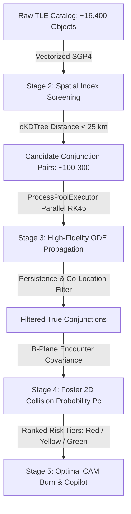

# 🛰️ OrbitalGuard: Real-Time Space Debris Tracker & Conjunction Assessment System

[](https://fastapi.tiangolo.com)
[](https://reactjs.org/)
[](https://threejs.org/)
[](https://celestrak.org)
[](LICENSE)

An end-to-end, enterprise-grade Space Situational Awareness (SSA) and Space Traffic Management (STM) platform. OrbitalGuard tracks **30,000+ active satellites and orbital debris objects** in real time, performs multi-stage conjunction screening with numerical orbital propagation, computes Foster 2D collision probabilities ($P_c$), models atmospheric drag with live space weather, and renders the entire orbital sphere via a high-performance Three.js GPU engine.

---

## 📑 Table of Contents

1. [System Overview & Architecture](#-system-overview--architecture)
2. [Conjunction Assessment Pipeline (Stages 1–5)](#-conjunction-assessment-pipeline)
3. [Astrodynamics & Mathematical Formulations](#-astrodynamics--mathematical-formulations)
   - [SGP4 & Coordinate Transformations](#1-sgp4-propagation--coordinate-frames)
   - [High-Fidelity Numerical Integration](#2-high-fidelity-numerical-integration-stage-3)
   - [Covariance & Collision Probability ($P_c$)](#3-empirical-covariance--foster-2d-pc-stage-4)
   - [Collision Avoidance Maneuver (CAM) Optimization](#4-collision-avoidance-maneuvers-cam)
4. [Frontend Architecture & 3D Visualization Engine](#-frontend-architecture--3d-visualization-engine)
5. [User Interface & Advanced Analytics Panels](#-user-interface--advanced-analytics-panels)
6. [Backend API Specifications](#-backend-api-specifications)
7. [Repository Structure & Code Tour](#-repository-structure--code-tour)
8. [Installation & Local Deployment Guide](#-installation--local-deployment-guide)

---

## 🌐 System Overview & Architecture

```
                                ┌──────────────────────────────────────┐
                                │   CelesTrak / Space-Track / NOAA     │
                                │   (16,000+ TLEs & Space Weather Ap)  │
                                └──────────────────┬───────────────────┘
                                                   │
                                                   ▼
┌─────────────────────────────────────────────────────────────────────────────────────────────┐
│                                BACKEND CONJUNCTION PIPELINE                                 │
│                                                                                             │
│   ┌─────────────────────┐       ┌──────────────────────┐       ┌────────────────────────┐   │
│   │ Stage 1: Ingestion  │ ────► │ Stage 2: Spatial     │ ────► │ Stage 3: High-Fidelity │   │
│   │ & Space Weather     │       │ Screening (cKDTree)  │       │ RK45 / J2-J6 / Drag    │   │
│   └─────────────────────┘       └──────────────────────┘       └───────────┬────────────┘   │
│                                                                            │                │
│   ┌─────────────────────┐       ┌──────────────────────┐                   │                │
│   │ Stage 5: CAM Solver │ ◄──── │ Stage 4: Covariance  │ ◄─────────────────┘                │
│   │ & AI Copilot        │       │ & Foster 2D Pc Risk  │                                    │
│   └─────────────────────┘       └──────────────────────┘                                    │
└──────────────────────────────────────────┬──────────────────────────────────────────────────┘
                                           │ WebSocket / REST API
                                           ▼
┌─────────────────────────────────────────────────────────────────────────────────────────────┐
│                                  FRONTEND CLIENT (REACT + VITE)                             │
│                                                                                             │
│   ┌─────────────────────────────────────────────────────────────────────────────────────┐   │
│   │ THREE.JS GPU ENGINE (CinematicEarth.jsx)                                            │   │
│   │  • 30,000 Particle Swarm BufferGeometry (Single Draw Call, 60 FPS)                 │   │
│   │  • Unbreakable Cartesian LineLoop Orbit Traces (No Anti-Meridian Seams)             │   │
│   │  • GPU Raycaster with Adaptive Bounding Spheres for Instant Selection               │   │
│   └─────────────────────────────────────────────────────────────────────────────────────┘   │
│   ┌───────────────────────────┬───────────────────────────┬─────────────────────────────┐   │
│   │ Satellite Info Panel      │ TLE & Orbit Data Panel    │ Real-Time Telemetry Graphs  │   │
│   │ (COSPAR, Launch, Country) │ (Live Speed, Height, RAAN)│ (Multi-Rev Speed/Height)    │   │
│   ├───────────────────────────┴───────────────────────────┴─────────────────────────────┤   │
│   │ Global Swarm Filters (Multi-Select Orbits: LEO/MEO/GEO, 45+ Mission Tags, Debris)   │   │
│   └─────────────────────────────────────────────────────────────────────────────────────┘   │
└─────────────────────────────────────────────────────────────────────────────────────────────┘
```

---

## ⚡ Conjunction Assessment Pipeline

The screening engine processes pairs of space objects across a 72-hour lookahead window through 5 cascaded filters:



### 1. Stage 1: Ingestion & Normalization (`app/core/fetch_data.py`, `app/core/space_weather.py`)
- Fetches active satellites and debris sets from CelesTrak OMM/JSON feeds.
- Ingests real-time NOAA space weather indices: Planetary $A_p$ index and $10.7\text{ cm}$ Solar Radio Flux ($F_{10.7}$), driving upper atmospheric thermospheric density models.

### 2. Stage 2: Coarse Spatial Screening (`app/core/spatial_index.py`)
- Propagates all objects across time slices ($\Delta t = 60\text{ s}$) using vectorized SGP4.
- Builds an Earth-Centered Inertial (ECI) 3D `scipy.spatial.cKDTree` spatial index at each epoch.
- Queries for all pairs within a radial search envelope ($d_{\text{coarse}} \le 25\text{ km}$), reducing $O(N^2) \approx 134\text{ million}$ candidate combinations down to a few hundred.

### 3. Stage 3: High-Fidelity Conjunction Refinement (`app/core/stage3_refine.py`)
- Dispatches close-approach candidates across CPU cores using Python `ProcessPoolExecutor`.
- Solves equations of motion using adaptive Runge-Kutta 4(5) (`scipy.integrate.solve_ivp`).
- **Co-Location & Formation Flying Filter**: Filters out false alarms from physical station modules (ISS, Tiangong) and intentional formation missions (TerraSAR-X/TanDEM-X, Hongtu-1 Cartwheel) via persistence and COSPAR launch analysis.
- Pinpoints the exact **Time of Closest Approach (TCA)** and minimum miss distance using Golden Section Search.

### 4. Stage 4: Covariance Modeling & Probability of Collision ($P_c$) (`app/core/stage4_pc.py`, `app/core/risk.py`)
- Constructs empirical RTN covariance matrices based on altitude regime, epoch age, and ballistic drag parameter $B^*$.
- Applies a hybrid **Hard-Body Radius (HBR)** model (RCS class primary + object type fallback + constellation geometry overrides).
- Projects combined positional covariance into the 2D encounter frame (B-plane) and evaluates Foster's 2D Gaussian integral for $P_c$.

### 5. Stage 5: Collision Avoidance Maneuver (CAM) Solver & Copilot (`app/core/cam_solver.py`, `app/api/routes/copilot.py`)
- Evaluates optimal impulsive burns ($\Delta \mathbf{v}$) in along-track, cross-track, and radial directions to clear the collision threshold ($P_c < 10^{-7}$, miss $> 5\text{ km}$) with minimum $\Delta v$.
- An integrated AI Copilot provides plain-language telemetry interpretation, threat explanations, and tactical maneuver briefs.

---

## 🧮 Astrodynamics & Mathematical Formulations

### 1. SGP4 Propagation & Coordinate Frames

The Simplified General Perturbations 4 (SGP4) analytical model propagates mean orbital elements under Earth oblateness ($J_2, J_3, J_4$), atmospheric drag, and gravitational resonance.

$$\mathbf{r}_{\text{ECI}}(t), \mathbf{v}_{\text{ECI}}(t) = \text{SGP4}(\text{TLE}, t)$$

To align ECI coordinates with the rotating Earth surface, Greenwich Mean Sidereal Time (GMST) is evaluated at timestamp $t$:

$$\theta_{\text{GMST}} = \text{gstime}(t)$$

$$\begin{bmatrix} x_{\text{ECEF}} \\ y_{\text{ECEF}} \\ z_{\text{ECEF}} \end{bmatrix} = \begin{bmatrix} \cos\theta_{\text{GMST}} & \sin\theta_{\text{GMST}} & 0 \\ -\sin\theta_{\text{GMST}} & \cos\theta_{\text{GMST}} & 0 \\ 0 & 0 & 1 \end{bmatrix} \begin{bmatrix} x_{\text{ECI}} \\ y_{\text{ECI}} \\ z_{\text{ECI}} \end{bmatrix}$$

Latitude ($\phi$), Longitude ($\lambda$), and Geodetic Height ($h$) are extracted via WGS-84 ellipsoidal geometry ($a = 6378.137\text{ km}, f = 1/298.257223563$).

---

### 2. High-Fidelity Numerical Integration (Stage 3)

Numerical refinement integrates the perturbed equations of motion:

$$\ddot{\mathbf{r}} = -\frac{\mu}{r^3}\mathbf{r} + \mathbf{a}_{\text{zonal}} + \mathbf{a}_{\text{drag}} + \mathbf{a}_{\text{third-body}}$$

#### Zonal Geopotential Harmonics ($J_2$ through $J_6$):
$$\Phi(r, \phi) = \frac{\mu}{r} \left[ 1 - \sum_{n=2}^{6} J_n \left(\frac{R_E}{r}\right)^n P_n(\sin\phi) \right]$$

#### Atmospheric Drag with Space Weather Modulation:
$$\mathbf{a}_{\text{drag}} = -\frac{1}{2} \rho(h, F_{10.7}, A_p) \left(\frac{C_D A}{m}\right) v_{\text{rel}} \mathbf{v}_{\text{rel}}$$
Where $\rho$ is the atmospheric density computed via NRLMSISE-00 thermospheric model, scaled by daily solar flux $F_{10.7}$ and geomagnetic storm index $A_p$.

---

### 3. Empirical Covariance & Foster 2D $P_c$ (Stage 4)

Because TLE sets omit covariance matrices, an empirical RTN (Radial, Transverse, Normal) covariance model is constructed:

$$\mathbf{C}_{\text{RTN}} = \text{diag}(\sigma_R^2, \sigma_T^2, \sigma_N^2) \cdot f(\text{age}) \cdot g(B^*)$$

Where $\sigma_T \gg \sigma_N > \sigma_R$ reflects along-track in-track uncertainty growth over time.

#### Encounter Frame (B-Plane) Projection:
Let $\mathbf{v}_{\text{rel}} = \mathbf{v}_1 - \mathbf{v}_2$ be the relative velocity vector at TCA. The encounter frame unit vectors are:
$$\hat{\mathbf{k}} = \frac{\mathbf{v}_{\text{rel}}}{\|\mathbf{v}_{\text{rel}}\|}, \quad \hat{\mathbf{i}} = \frac{\mathbf{v}_1 \times \mathbf{v}_2}{\|\mathbf{v}_1 \times \mathbf{v}_2\|}, \quad \hat{\mathbf{j}} = \hat{\mathbf{k}} \times \hat{\mathbf{i}}$$

The combined covariance on the collision B-plane is:
$$\mathbf{C}_{2D} = \mathbf{M} (\mathbf{C}_{\text{ECI},1} + \mathbf{C}_{\text{ECI},2}) \mathbf{M}^T$$

#### Foster 2D Collision Probability:
Assuming rectilinear relative motion during the encounter, the 3D collision probability collapses to a 2D Gaussian integral over the combined Hard-Body circle $R_{\text{HBR}} = R_1 + R_2$:

$$P_c = \frac{1}{2\pi \sqrt{\det \mathbf{C}_{2D}}} \iint_{x^2 + y^2 \le R_{\text{HBR}}^2} \exp\left( -\frac{1}{2} \begin{bmatrix} x - x_e \\ y - y_e \end{bmatrix}^T \mathbf{C}_{2D}^{-1} \begin{bmatrix} x - x_e \\ y - y_e \end{bmatrix} \right) dx\,dy$$

```
   Encounter B-Plane Projection
   ─────────────────────────────
              y (Cross-Track)
              ▲
              │      Combined Covariance Ellipse
              │     . - - - - .
              │   '     ___     '
              │  '    /  _  \    '
              │ (    | (o) | )    )  ◄── Combined Hard-Body Radius (HBR)
              │  '    \ ___ /    '
              │   '             '
              │     ' - - - - '
              └─────────────────────► x (Along-Track)
                    (xe, ye) = Miss Vector
```

---

### 4. Collision Avoidance Maneuvers (CAM)

When $P_c > 10^{-4}$ (Red Alert), the CAM optimizer computes the minimum burn vector $\Delta \mathbf{v} = (\Delta v_R, \Delta v_T, \Delta v_N)$ applied $\Delta t_{\text{burn}}$ before TCA:

$$\min \|\Delta \mathbf{v}\| \quad \text{subject to} \quad P_c(\Delta \mathbf{v}) \le 10^{-7}, \quad \|\mathbf{r}_{\text{rel}}(\text{TCA})\| \ge 5.0\text{ km}$$

---

## 🎨 Frontend Architecture & 3D Visualization Engine

The user interface is designed with a **cyber-tactical military command center** aesthetic.

```
frontend/src/
├── components/
│   ├── CinematicEarth.jsx       # Core 3D globe & Three.js particle engine
│   ├── panels/
│   │   ├── SatellitePanel.jsx   # Top-level drawer container with icon tab bar
│   │   ├── InfoTab.jsx          # Satellite metadata, imagery & launch information
│   │   ├── TLETab.jsx           # Live orbital elements table & raw TLE copy
│   │   ├── GraphsTab.jsx        # Multi-revolution Speed & Height line charts
│   │   └── FiltersPanel.jsx     # Live multi-select Orbit, Tag & Debris filters
│   ├── CopilotPanel.jsx         # AI Conjunction Assistant & conversational analysis
│   ├── ThreatFeed.jsx           # Live streaming high-risk conjunction alerts
│   └── TopNav.jsx               # System status, DEFCON level & UTC clock
```

### High-Performance 3D Optimization Techniques:
1. **Single-Draw-Call Particle Swarm (`THREE.Points`)**:
   Instead of creating 30,000 individual Three.js meshes (which degrades WebGL performance to <5 FPS), the entire satellite swarm is held in a continuous `Float32Array(90000)` buffer inside a single `THREE.BufferGeometry`. This maintains a consistent **60 FPS**.
2. **Dynamic Canvas Texture Points**:
   Points are rendered with an in-memory generated circular `CanvasTexture` and `alphaTest = 0.5`, producing anti-aliased circular orbs instead of blurry square pixels.
3. **Seamless Cartesian Orbit Rings (`THREE.LineLoop`)**:
   Standard spherical line renderers suffer from discontinuous jump-cuts when crossing the $180^\circ$ anti-meridian. OrbitalGuard bypasses this by calculating continuous 3D Cartesian coordinates directly from SGP4 propagation:
   $$x = r \sin\phi \cos\theta, \quad y = r \cos\phi, \quad z = r \sin\phi \sin\theta$$
4. **Adaptive Raycasting**:
   A bounding sphere with $r = 200$ is injected into the swarm geometry, enabling instant raycaster intersection for hover and target lock on 30,000 moving dots.

---

## 🖥️ User Interface & Advanced Analytics Panels

| Feature | Description | Screenshot Reference |
| :--- | :--- | :--- |
| **Info Tab** | Displays high-resolution satellite imagery, COSPAR International Designator, Orbit Regime, Operational Status, Satellite Type (Payload/Debris), Country of Origin, Owner/Operator, Launch Site, Launch Vehicle, and Launch Date. | `media_1787425188492.jpg` |
| **TLE Tab** | Dynamic *time-since-epoch* counter, raw TLE code block with one-click clipboard copy, and live orbital parameters (Speed, Altitude, Lat/Lng, Inclination, Period, Eccentricity, RAAN, Argument of Perigee, Mean Anomaly). | `media_1787425303006.jpg` |
| **Graphs Tab** | Recharts-powered telemetry charts featuring a **Revolutions Selector** (1–4 orbits) displaying smooth SGP4 speed ($\text{km/h}$) and altitude ($\text{km}$) curves over time. | `media_1787424900227.jpg` |
| **Filters Panel** | Real-time 3D swarm filtering: Multi-select Orbits (`GEO`, `MEO`, `LEO`, `HEO`, `Other`), 45+ Mission/Constellation Tags (`Starlink`, `OneWeb`, `GPS`, `Galileo`, `Iridium`, `Weather`, `Military`, etc.), and Debris modes (`Show`, `Hide`, `Debris only`). | `media_1787424726609.png` |
| **Top Navigation Bar** | Sleek glassmorphic controls to toggle swarm visibility, swap Earth day/night textures, trigger global filters, and reset 3D camera orientation. | Top center overlay |

---

## 🔌 Backend API Specifications

The FastAPI backend exposes RESTful and WebSocket endpoints on `http://127.0.0.1:8000`:

| Method | Endpoint | Description |
| :--- | :--- | :--- |
| `GET` | `/api/v1/globe-data?limit=16000` | Returns full TLE lines and rich metadata for all active satellites and debris. |
| `GET` | `/api/v1/conjunctions?page=1&size=50` | Returns screened conjunction events ranked by risk tier, $P_c$, and miss distance. |
| `GET` | `/api/v1/conjunctions/{id}` | Detailed conjunction telemetry, relative velocity vectors, and B-plane parameters. |
| `POST` | `/api/v1/cam/solve` | Computes optimal collision avoidance burn vectors ($\Delta \mathbf{v}$) for a conjunction. |
| `POST` | `/api/v1/copilot/chat` | AI Copilot conversational endpoint for astrodynamic reasoning and event analysis. |
| `GET` | `/api/v1/weather/current` | Returns live NOAA space weather indices ($A_p$, $F_{10.7}$, solar activity). |
| `GET` | `/api/v1/stats/overview` | Summary counts of active payloads, trackable debris, and conjunction alert levels. |

---

## 📂 Repository Structure & Code Tour

```
space-debris-tracker/
├── backend/
│   ├── app/
│   │   ├── api/
│   │   │   └── routes/
│   │   │       ├── globe.py          # /api/v1/globe-data (TLE generation & metadata)
│   │   │       ├── conjunctions.py    # Conjunction endpoints & event retrieval
│   │   │       ├── cam.py             # Collision avoidance maneuver solver API
│   │   │       ├── copilot.py         # AI Copilot assistant with orbital context
│   │   │       ├── weather.py         # NOAA space weather proxy
│   │   │       └── stats.py           # Fleet & threat matrix statistics
│   │   ├── core/
│   │   │   ├── spatial_index.py       # Stage 2: cKDTree fast spatial filtering
│   │   │   ├── stage3_refine.py       # Stage 3: Parallel RK45 propagation & force models
│   │   │   ├── stage4_pc.py           # Stage 4: Covariance scaling & B-plane integration
│   │   │   ├── risk.py                # Foster 2D Pc solver & HBR sizing engine
│   │   │   ├── cam_solver.py          # Impulsive burn optimizer
│   │   │   └── space_weather.py       # NOAA Space Weather Prediction Center client
│   │   ├── data/cache/
│   │   │   └── active_tles.json       # Cached 16,400+ orbital element records
│   │   ├── schemas/                   # Pydantic data contracts (objects, conjunctions, CAM)
│   │   └── main.py                    # FastAPI application initialization & middleware
│   └── requirements.txt               # Backend dependencies (FastAPI, Scipy, SGP4, etc.)
│
├── frontend/
│   ├── src/
│   │   ├── components/
│   │   │   ├── CinematicEarth.jsx     # Master 3D globe visualization & particle engine
│   │   │   ├── panels/                # Tactical analytics sliding drawers
│   │   │   │   ├── SatellitePanel.jsx # Main drawer container & tab switcher
│   │   │   │   ├── InfoTab.jsx        # Metadata, imagery & COSPAR details
│   │   │   │   ├── TLETab.jsx         # Live orbital elements & raw TLE copy
│   │   │   │   ├── GraphsTab.jsx      # Recharts Speed & Altitude multi-orbit graphs
│   │   │   │   └── FiltersPanel.jsx   # Real-time multi-select swarm filters
│   │   │   ├── CopilotPanel.jsx       # LLM Conjunction Assistant drawer
│   │   │   ├── ThreatFeed.jsx         # High-risk alert stream
│   │   │   └── TopNav.jsx             # Top bar header with system telemetry
│   │   ├── App.jsx                    # Root application component
│   │   ├── index.css                  # Tactical military design system & animations
│   │   └── main.jsx                   # React entry point
│   ├── package.json                   # Frontend dependencies (React, Three.js, Recharts)
│   └── vite.config.js                 # Vite bundler configuration
└── README.md                          # Comprehensive system documentation
```

---

## 🚀 Installation & Local Deployment Guide

### Prerequisites
- **Python 3.10+**
- **Node.js 18+** & **npm**

---

### Step 1: Clone the Repository
```bash
git clone https://github.com/your-org/space-debris-tracker.git
cd space-debris-tracker
```

---

### Step 2: Backend Setup
```bash
cd backend

# Create and activate a virtual environment
python3 -m venv venv
source venv/bin/activate  # On Windows: venv\Scripts\activate

# Install dependencies
pip install -r requirements.txt

# Start the FastAPI backend server
python3 -m uvicorn app.main:app --reload --port 8000
```
Backend API will be running on **`http://127.0.0.1:8000`** (Interactive OpenAPI docs at **`http://127.0.0.1:8000/docs`**).

---

### Step 3: Frontend Setup
Open a new terminal window:
```bash
cd frontend

# Install npm dependencies (including Three.js & Recharts)
npm install

# Start the Vite development server
npm run dev
```
Frontend application will be accessible at **`http://localhost:5174`** (or `http://localhost:5173`).

---

## 🛡️ License

This project is licensed under the MIT License — see the [LICENSE](LICENSE) file for details.
